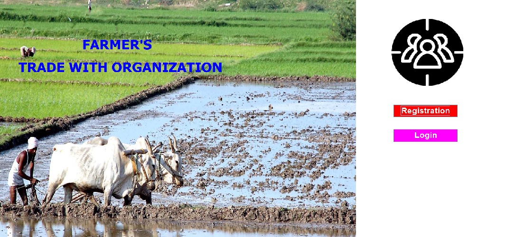
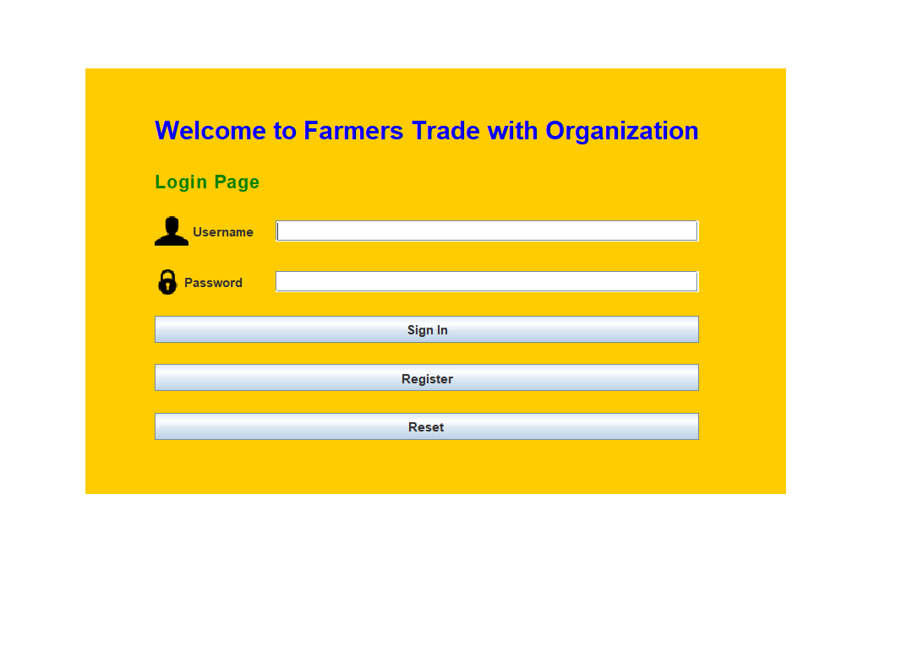
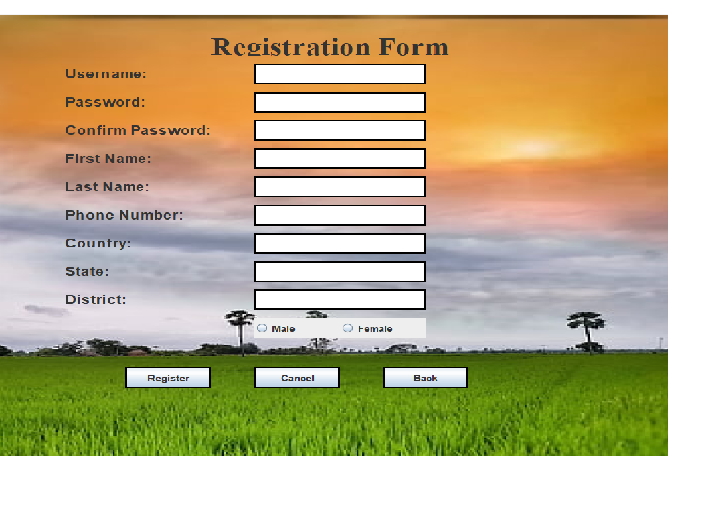
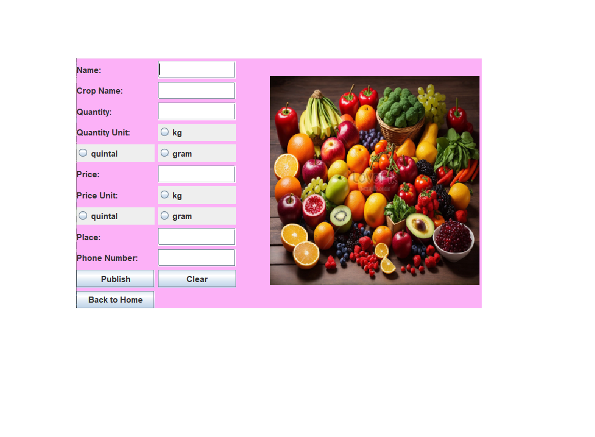
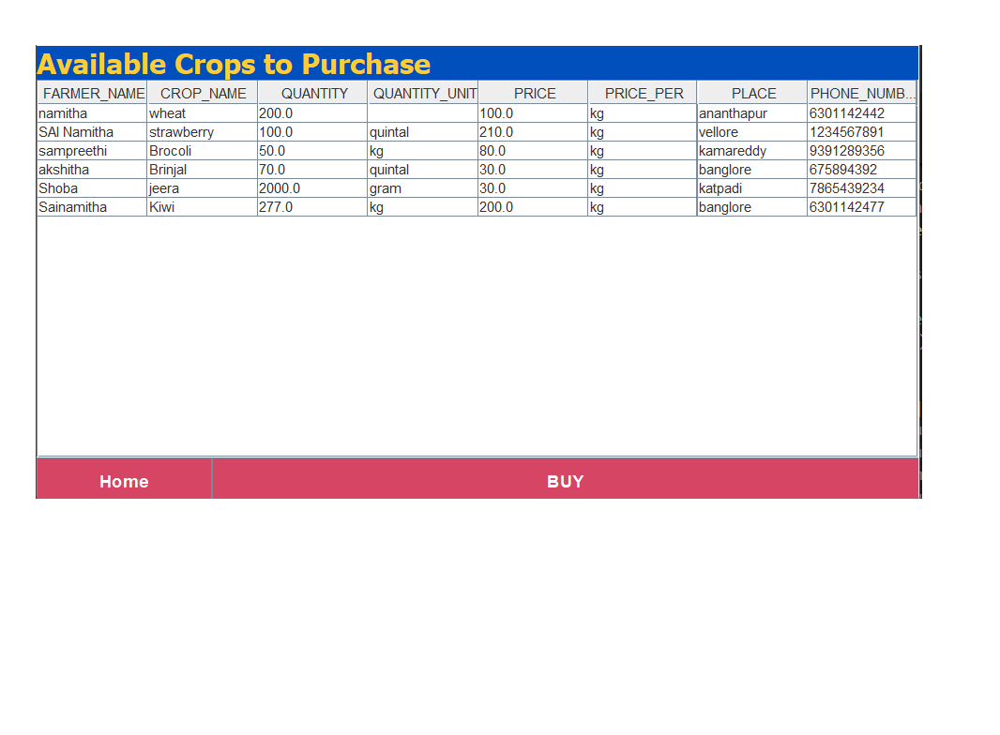
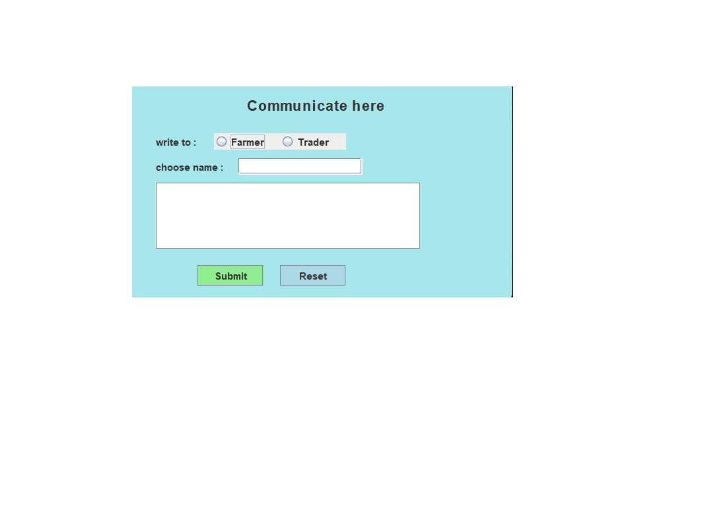
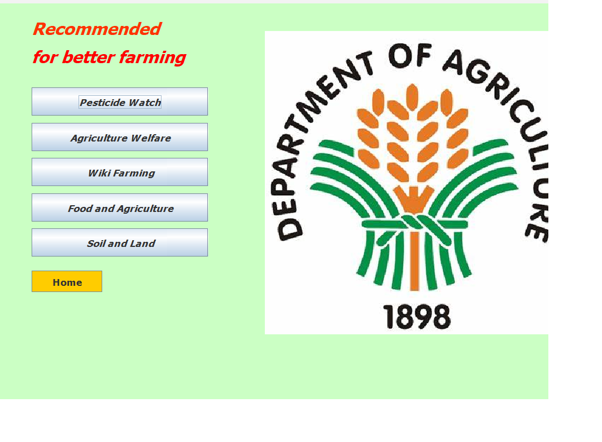

# Farmer-Trading-System
Java Swing based Farmer Trading System using MySQL and JDBC

## Overview
Farmer Trading System is a Java-based desktop application developed using Java Swing, MySQL, and JDBC.  
The system enables farmers to publish crop details and consumers to view and purchase crops directly through a user-friendly graphical interface.

---

## Features
- User Registration and Login
- Secure Authentication System
- Crop Publishing Module
- Consumer Dashboard
- Crop Listing and Viewing
- Farmer–Consumer Communication
- Recommendation Module
- MySQL Database Connectivity
- Input Validation and Exception Handling

---

## Technologies Used
- Java
- Java Swing
- JDBC
- MySQL
- Object-Oriented Programming (OOP)

---

## Modules

### Registration Module
Allows users to register with personal details such as username, password, phone number, country, state, and district.

### Login Module
Provides secure user authentication using MySQL database verification.

### Publish Crop Module
Farmers can publish crop details including:
- Crop Name
- Quantity
- Quantity Unit
- Price
- Place
- Contact Information

### Consumer Module
Consumers can:
- View available crops
- Access farmer details
- Browse crop information

### Communication Module
Allows communication between farmers and consumers through a messaging interface.

### Recommendation Module
Provides useful agriculture and farming-related recommendation resources and websites.

---

## Database
The project uses MySQL database for storing:
- User Registration Details
- Crop Information
- Farmer Details

---

## Project Workflow
1. User Registration
2. Login Authentication
3. Crop Publishing by Farmers
4. Crop Viewing by Consumers
5. Communication Between Users
6. Access Farming Recommendations

---

## Project Structure

```text
Farmer-Trading-System
│
├── Communicate.java
├── Consumer.java
├── Home.java
├── Login.java
├── MyFrame.java
├── Publish.java
├── Recommendations.java
├── Registration.java
└── README.md
```

---

## Project Screenshots

### Home Page


### Login Page


### Registration Page


### Publish Crop Module


### Consumer Dashboard


### Communication Module


### Recommendations Module


---

## Future Improvements
- Online Payment Integration
- Real-time Chat System
- AI-based Crop Recommendations
- Mobile Application Support
- Cloud Database Integration

---

## Author
**Kuridi Chalapathi Sai Namitha**
